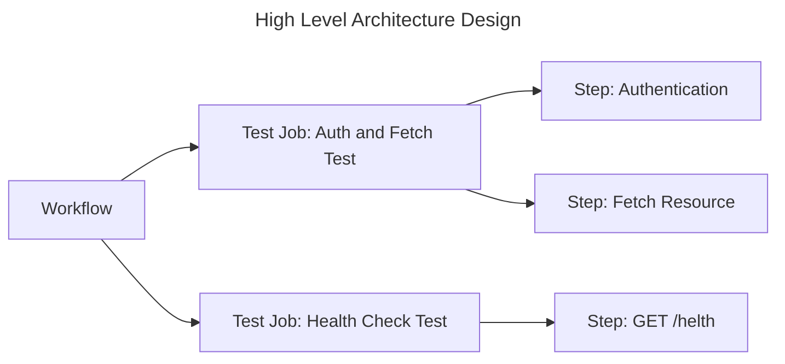

# Design Doc of Kooparts

## Goal

Kooparts provide easy way to test WebAPI.

## Background

Kotlin/Native is a technology for compiling Kotlin code to native binaries which can run without a virtual machine.
It is ideal for situations when a developer needs to produce a self-contained program that does not require an additional runtime or virtual machine.

Kotlin/native is a technology full of possibilities.  
We believe that Kotlin/native allows us to develop a self-contained, easy-to-execute WebAPI testing tool.

## High Level Architecture Design

Kooparts is composed of three core components.  
These components are inspired by GitHub actions.

- Workflow  
  A workflow is the root component of an automated process.
  Workflow will run one or more Test Jobs.
- Test Job  
  A Test Job is the test case of WebAPI. 
  Test Job defined by sequential steps.  
  Test Jobs are independent other Test Job and can be executed in parallel or concurrently.
- Step  
  A Step is a single request to the test target WebAPI.  
  Step is modularity.

## Concept

Workflow are defined by a YAML file.  
YAML file is composable as Test Job and Step unit.
